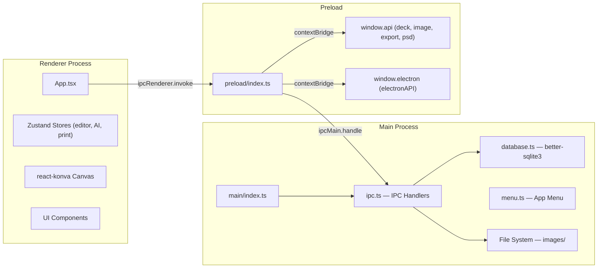
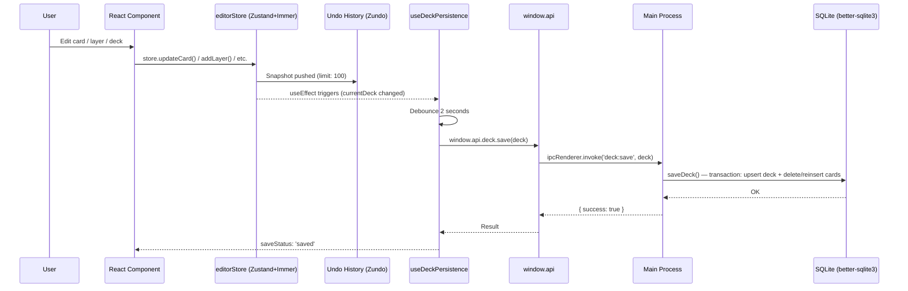
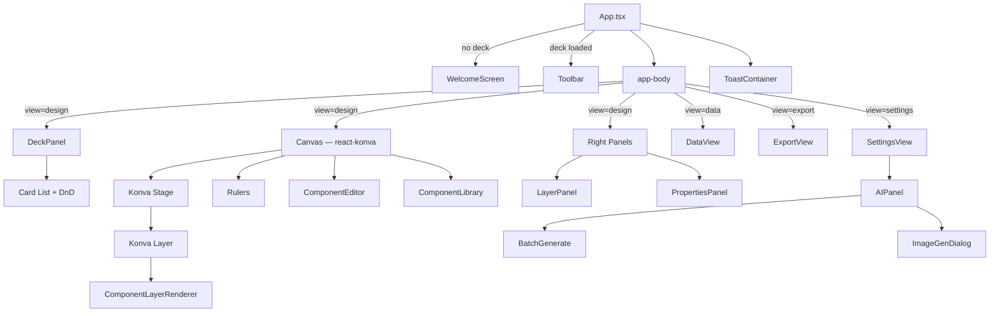
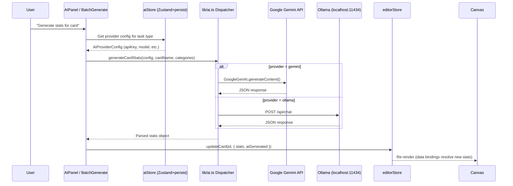
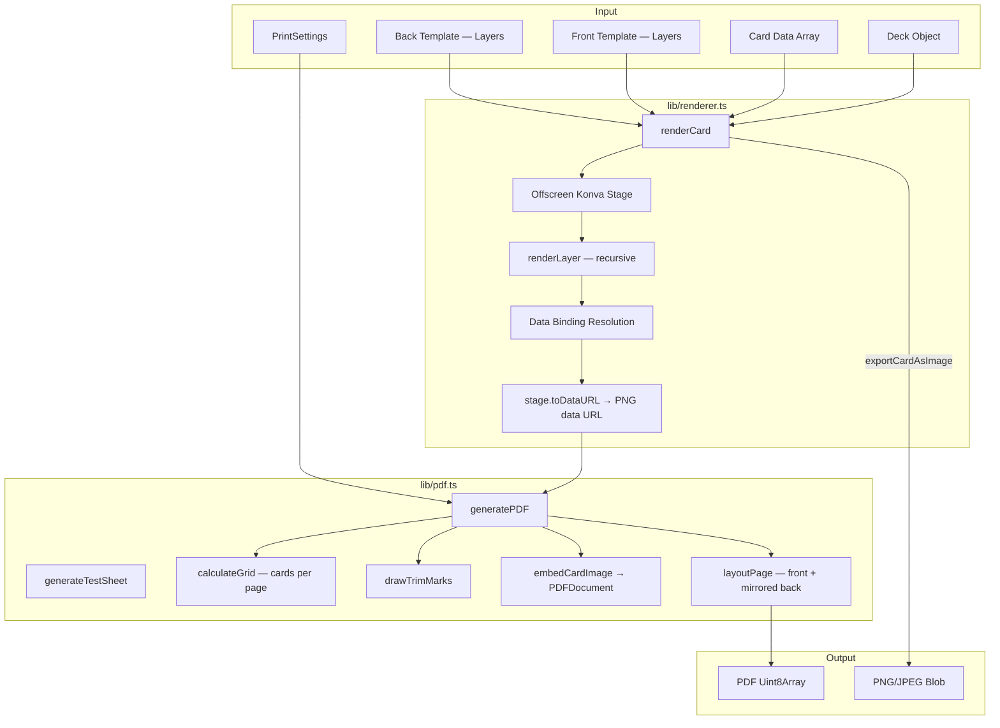
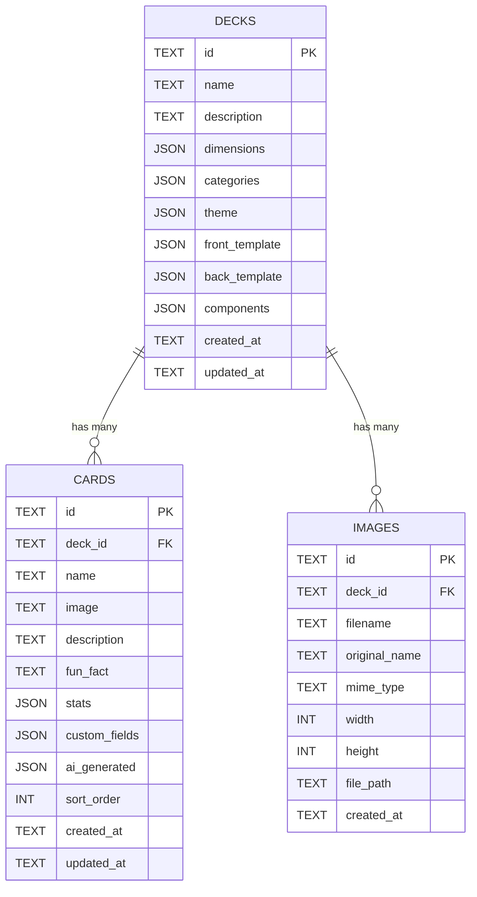
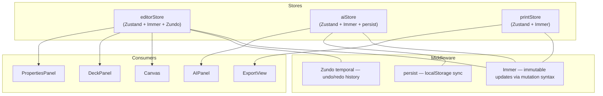

# DeckForge Architecture

## Overview

DeckForge is an Electron desktop application for designing, creating, and printing custom card decks. It follows a classic Electron three-process model with a Zustand-based reactive state layer, SQLite persistence, and pluggable AI backends.

---

## 1. Process Communication

### IPC Channels

| Channel | Direction | Purpose |
|---------|-----------|---------|
| `deck:save` | Renderer → Main | Persist deck + cards to SQLite |
| `deck:load` | Renderer → Main | Load deck by ID from SQLite |
| `deck:list` | Renderer → Main | List all saved decks |
| `deck:delete` | Renderer → Main | Delete deck and cascade cards |
| `image:import` | Renderer → Main | Open file dialog, copy to images dir |
| `image:import-buffer` | Renderer → Main | Import drag-and-drop image buffer |
| `image:get-path` | Renderer → Main | Resolve image filename to full path |
| `export:save-file` | Renderer → Main | Show save dialog, write exported file |
| `psd:import` | Renderer → Main | Open PSD file, return base64 buffer |

---

## 2. Data Flow: User Action → Store → SQLite → Auto-save

### Key Details
- **Debounced auto-save**: 2-second debounce after any `currentDeck` state change
- **Transactional writes**: Deck + all cards saved in a single SQLite transaction
- **WAL mode**: `journal_mode = WAL` for concurrent read/write performance
- **Undo/Redo**: Zundo temporal middleware keeps 100 history snapshots in memory

---

## 3. Component Hierarchy

### View Modes
| View | Components | Purpose |
|------|-----------|---------|
| `design` | DeckPanel + Canvas + LayerPanel + PropertiesPanel | Visual card template editor |
| `data` | DataView | Spreadsheet-like card data management |
| `export` | ExportView | PDF/PNG export with print settings |
| `settings` | SettingsView → AIPanel | AI provider configuration |

---

## 4. AI Integration Flow

### AI Capabilities
| Task | Gemini | Ollama | Function |
|------|--------|--------|----------|
| Text generation | ✅ gemini-2.0-flash | ✅ llama3.2 | `generateText()` |
| Image generation | ✅ imagen-3.0 | ❌ | `generateImage()` |
| Vision/analysis | ✅ gemini-2.0-flash | ✅ llava | `analyzeImage()` |
| Card descriptions | ✅ | ✅ | `generateCardDescription()` |
| Stat generation | ✅ | ✅ | `generateCardStats()` |
| Fun facts | ✅ | ✅ | `generateFunFact()` |

### AI Settings Persistence
The `aiStore` uses Zustand's `persist` middleware with `localStorage` key `deckforge-ai-settings`, storing provider configs and default assignments separately from the main SQLite database.

---

## 5. Export Pipeline

### Rendering Pipeline Details

1. **Card Rendering** (`renderCard`):
   - Creates offscreen Konva Stage at target DPI
   - Recursively renders each layer (text, shape, image, group)
   - Resolves data bindings: `bindTo` field maps layer content to card data (`name`, `description`, `stat:categoryId`, `custom:key`)
   - Returns PNG data URL

2. **PDF Generation** (`generatePDF`):
   - Creates PDFDocument via pdf-lib
   - Calculates grid layout (cards per page based on paper size)
   - Renders all card fronts, then all card backs
   - Lays out with centered grid, configurable spacing
   - Back pages mirror column order for double-sided printing
   - Adds trim marks at card corners
   - Supports front/back offset adjustment for printer alignment

3. **Image Export** (`exportCardAsImage` / `exportAllCards`):
   - Renders individual cards to data URL
   - Converts to Blob with format conversion if needed (PNG/JPEG)
   - Progress callback for batch operations

---

## 6. Database Schema

### Storage Locations
- **SQLite DB**: `{userData}/deckforge.db` (WAL mode)
- **Images**: `{userData}/images/` (content-addressed by SHA-256 hash prefix)
- **AI Settings**: `localStorage` key `deckforge-ai-settings`

---

## 7. State Management Architecture

Each store is independent with fine-grained selectors for minimal re-renders.
